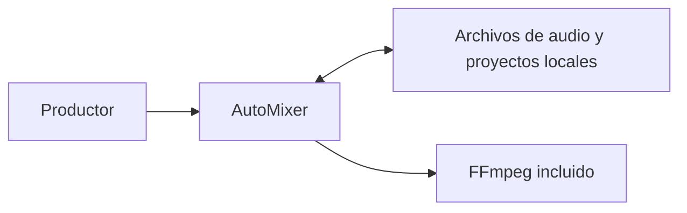
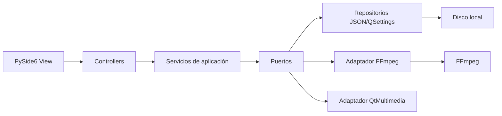
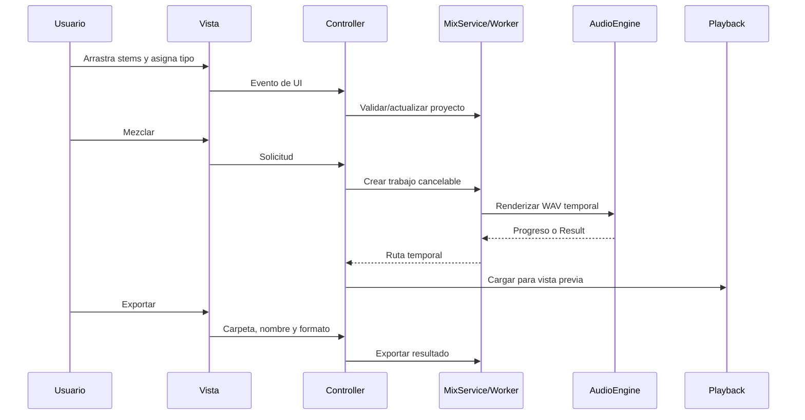

# AutoMixer — Arquitectura

**Estado:** aprobado para especificación funcional · **Fecha:** 2026-08-31 · **Alcance:** MVP local, un proyecto = una canción.

## Objetivo y límites

Aplicación de escritorio para importar stems MP3/FLAC/WAV, clasificarlos manualmente, aplicar un perfil Pop/Rock/Hip Hop, previsualizar y exportar. No usa red ni copia los audios al proyecto: guarda rutas y ajustes. Quedan fuera cuentas, nube, edición multipista avanzada, plugins, IA generativa y procesamiento por lotes.

## Stack propuesto

| Área | Decisión |
|---|---|
| Runtime/GUI | Python 3.12 + PySide6 |
| Audio | FFmpeg incluido en cada distribución; invocado sin shell |
| Vista previa | WAV temporal estéreo con QtMultimedia |
| Persistencia | Proyecto JSON versionado (`.automixer`) y `QSettings` para preferencias |
| Perfiles/i18n | JSON; traducciones español/inglés con idioma del sistema y selector |
| Empaquetado | PyInstaller, generado por separado para Linux y Windows |

La distribución debe incluir los avisos de licencia de FFmpeg y de sus códecs.

## C4

### Contexto



### Contenedores/componentes



## Capas y estructura

Regla estricta: **View → Controller → Service → Repository/Port → Adapter**. La vista nunca procesa audio ni accede a disco; los controladores no contienen reglas de mezcla. La inyección de dependencias se hace manualmente en `app.py`. Los servicios devuelven `Result` y transforman fallos externos en errores de dominio.

```text
src/
  app.py                 # composición de dependencias
  models/                # MixProject, Stem, MixProfile, ExportSettings
  views/                 # ventana, lista de stems, reproductor, diálogos
  controllers/           # eventos de la UI y actualización de la vista
  services/              # proyecto, mezcla, exportación, alineación, ajustes
  ports/                 # contratos de audio, reproducción y persistencia
  repositories/          # JSON de proyecto y QSettings
  adapters/              # FFmpeg, QtMultimedia, sistema de archivos
  workers/               # trabajos cancelables y señales de progreso
  i18n/                  # catálogos de idioma
  utils/                 # Result, validación y errores
```

## Contratos y modelo de datos

| Puerto | Responsabilidad |
|---|---|
| `ProjectRepository` | crear con nombre/ruta, guardar/cargar JSON de forma atómica, manual y automática |
| `AudioEngine` | analizar, sincronizar tempo, alinear inicio, renderizar y exportar |
| `Playback` | cargar WAV temporal, reproducir, pausar, detener y buscar posición |
| `ArtifactStore` | crear/limpiar temporales de mezcla |
| `SettingsRepository` | idioma y preferencias de aplicación |

`MixProject` contiene versión de esquema, género, stems, ajustes y el ID de referencia fijada al establecer tempo/alineación, que el usuario puede cambiar manualmente. Al cambiarla se recalculan las correcciones automáticas de los stems sin desfase manual. Cada `Stem` contiene ruta, tipo manual, ganancia (−60 a +12 dB), correcciones no destructivas de tempo/inicio, desfase manual positivo/negativo en ms y estado de disponibilidad. El desfase manual anula la alineación automática solo de ese stem. `Restablecer` devuelve volumen, desfase y correcciones al perfil activo. Si luego se agrega una batería, esta se adapta a la referencia existente. El resultado es estéreo, termina con el stem más largo y exporta WAV 44.1 kHz/24-bit o MP3 320 kbps. La referencia inicial es batería; si no existe, el primer stem. `Otro` usa un perfil neutro. Los efectos se aplican solo al temporal o al archivo exportado.

## Flujo principal



Se permite un trabajo de audio por vez. El worker emite progreso; al cancelar, termina el proceso, conserva el proyecto y limpia solo temporales propios. Al cerrar proyecto o aplicación se eliminan los temporales de vista previa, nunca los archivos exportados. Al cerrar durante un trabajo, la vista solicita confirmación y el controlador cancela el worker antes de salir. Exportar solicita confirmación si el destino ya existe.

## Decisiones (ADR propuestas)

| ADR | Decisión | Motivo |
|---|---|---|
| 001 | Monolito MVC local | Menos complejidad; separa UI, reglas y E/S. |
| 002 | FFmpeg empaquetado | Mismos formatos y mezcla en Linux/Windows sin instalación. |
| 003 | JSON con rutas, no copias | Proyectos ligeros; al faltar archivo se solicita reubicarlo. |
| 004 | WAV temporal + QtMultimedia | Vista previa fiable del resultado sin otro motor de audio. |

## Reglas, riesgos y validación

- Validar extensión, existencia y decodificación; habilitar la mezcla con al menos un stem válido; no interpolar rutas en comandos ni usar `shell=True`.
- Limitar FFmpeg a archivos seleccionados, usar temporales privados y borrar solo los creados por la aplicación.
- El guardado automático se ejecuta tras cambios relevantes; escribir primero un temporal y reemplazar atómicamente el proyecto.
- Perfiles de género son datos JSON fijos; sus reglas no viven en la UI ni se editan en el MVP.
- Riesgos: CPU/duración de render, artefactos al sincronizar tempo y obligaciones de licencia. Si el análisis de sincronización o alineación no es fiable, advertir y mantener el stem sin modificar; se podrá aplicar un desfase manual en ms. Mostrar errores claros y permitir cancelar.
- Verificar: servicios con puertos falsos, contratos de repositorios, integración de FFmpeg y flujos de importar/mezclar/previsualizar/exportar/cancelar.

## Decisión de alcance

Los perfiles Pop, Rock y Hip Hop son fijos en el MVP. La única personalización por stem es el volumen manual.

## Changelog

- **0.1.0 (2026-08-31):** arquitectura inicial propuesta, sin código ni dependencias.
